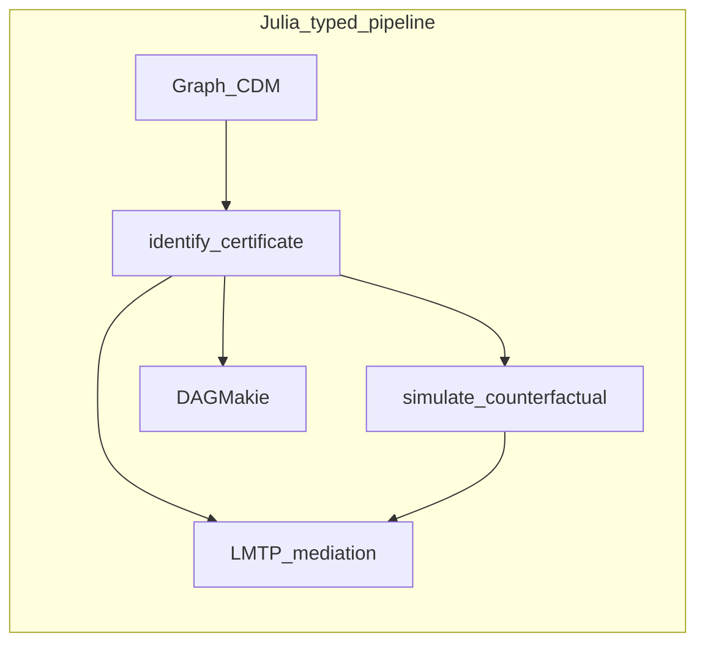

# How CausalTargeted compares

CausalTargeted.jl estimates continuous and longitudinal causal parameters after
identification: LMTP / MTP grids, positivity and omitted-confounder diagnostics,
and small-*n* Super Learner profiles. Mediation TE / NDE / NIE grids live in
[CausalMediation.jl](https://simonab.github.io/CausalMediation.jl/dev/) (soft
façades remain here). Graphs and certificates live upstream in
[CausalDynamics.jl](https://simonab.github.io/CausalDynamics.jl/dev/).

R packages [lmtp](https://cran.r-project.org/package=lmtp) and
[crumble](https://cran.r-project.org/package=crumble) are the closest conceptual
analogues (not API identity; see [NAMING.md](https://github.com/SimonAB/CausalTargeted.jl/blob/main/NAMING.md)).
[Ananke](https://github.com/UH-CAnD3/ananke) is the main Python LMTP reference.
[DoubleML](https://docs.doubleml.org/) is Neyman-orthogonal and related in spirit,
not full LMTP parity.

**Choose CausalTargeted when** you already have (or can obtain) an
`IdentificationResult`, want Julia-native LMTP/mediation grids with fold caches,
and care about small-*n* defaults and certificates on the estimate.

**Prefer lmtp / Ananke when** your pipeline is already R or Python end-to-end, or
you need a specialised option (e.g. GPU Riesz nets, survival LMTP flavours) that
we deliberately do not claim.

Stack overview:
[ECOSYSTEM_COMPARISON.md](https://github.com/SimonAB/CausalTargeted.jl/blob/main/ECOSYSTEM_COMPARISON.md).

## Legend

| Mark | Meaning |
|------|---------|
| `Yes` | First-class, documented |
| `Partial` | Possible with glue or a limited API |
| `—` | Not in that package’s usual scope |
| `Unique` | Strong differentiator here |

## Versus R and Python (targeted estimation)

| Capability | CausalTargeted | R | Python |
|------------|----------------|---|--------|
| LMTP / continuous MTP δ-grids | Yes | Yes (lmtp) | Yes (Ananke) |
| Sequential / longitudinal LMTP | Yes | Yes (lmtp) | Yes (Ananke) |
| Interventional mediation TE/NDE/NIE | Soft façade → [CausalMediation](https://simonab.github.io/CausalMediation.jl/dev/) | Yes (crumble, tmle3 mediation) | Partial (Ananke) |
| Cross-fit Super Learner profiles | Yes (lean / rich / small-*n*) | Yes (sl3 + lmtp/tmle3) | Partial (DoubleML / EconML nuisances) |
| Point-treatment TMLE (CM/ATE) | — (use [TMLE.jl](https://github.com/TARGENE/TMLE.jl)) | Yes (tmle / tmle3) | Partial (Ananke, others) |
| Consumes upstream graph ID certificate | Unique | Partial (separate packages) | Partial (DoWhy closer) |
| Positivity atlas / diagnostics | Yes | Partial (lmtp) | Partial |
| Omitted-confounder sensitivity | Yes | Yes (sensemakr + glue) | Partial (DoWhy) |
| DiD / g-computation utilities | Yes | Yes (did / g-comp pkgs) | Partial (CausalML / DoWhy) |
| Full parity with every lmtp/crumble option | — (deliberate) | Yes | — |

## Julia neighbours

| Package | Role |
|---------|------|
| [CausalDynamics.jl](https://simonab.github.io/CausalDynamics.jl/dev/) | `identify`, `IdentificationResult`, CDMs ([comparison](https://simonab.github.io/CausalDynamics.jl/dev/comparison/)) |
| [TMLE.jl](https://github.com/TARGENE/TMLE.jl) | Point-treatment CM / ATE / AIE |
| [DAGMakie.jl](https://simonab.github.io/DAGMakie.jl/dev/) | Optional DAG figures ([comparison](https://simonab.github.io/DAGMakie.jl/dev/comparison/)) |

## What is distinctive here

- **Typed hand-off** — `plan_mtp` / `execute_estimand` carry identification
  certificates into estimate metadata
- **Small-*n* defaults** — learner profiles and checklists aimed at tens to low
  hundreds of units (see [Small-*n* checklist](small_n.md))
- **Julia-native EIF grids** — no RCall on the estimation path

## What we deliberately do not claim

Full parity with every option in R `lmtp` / `crumble` (GPU Riesz nets, all
mediation estimand flavours, survival LMTP). See [Methods](methods.md).

The [CDCS book](https://simonab.github.io/causal-dynamics-book/) walks identify →
estimate → display end to end.
